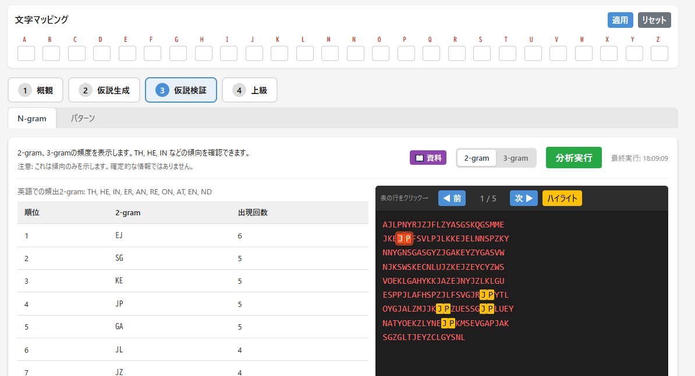

<!--
---
id: day106
slug: substitution-cipher-analysis-workbench

title: "Substitution Cipher Analysis Workbench"

subtitle_ja: "手動による換字式暗号解析支援ツール"
subtitle_en: "A manual analysis workbench for solving substitution ciphers"

description_ja: "換字式暗号を手動で解読するための統合分析ワークベンチ。統計、一致指数、N-gram、パターン分析など多角的なアプローチをサポート。"
description_en: "An integrated analysis workbench for manually decrypting substitution ciphers. Supports multi-faceted approaches including statistics, index of coincidence, N-grams, and pattern analysis."

category_ja:
  - 暗号解読
  - 古典暗号
category_en:
  - Cryptanalysis
  - Classical Cipher

difficulty: 4

tags:
  - substitution-cipher
  - cryptanalysis
  - frequency-analysis
  - index-of-coincidence
  - n-gram
  - kasiski-test

repo_url: "https://github.com/ipusiron/substitution-cipher-analysis-workbench"
demo_url: "https://ipusiron.github.io/substitution-cipher-analysis-workbench/"

hub: true
---
-->

# Substitution Cipher Analysis Workbench – 手動による換字式暗号解析支援ツール


[](https://ipusiron.github.io/substitution-cipher-analysis-workbench/)

**Day106 - 生成AIで作るセキュリティツール200**

換字式暗号を手動で解読するための統合分析ワークベンチです。
自動解読は行わず、統計分析・頻度分析・N-gram分析・パターン分析などの多角的なアプローチで解読作業を支援します。

---

## 🌐 デモページ

👉 **[https://ipusiron.github.io/substitution-cipher-analysis-workbench/](https://ipusiron.github.io/substitution-cipher-analysis-workbench/)**

ブラウザーで直接お試しいただけます。

---

## 📸 スクリーンショット

> 
> *暗号文の統計分析と解読進捗の可視化*

> 
> *N-gram分析による頻出パターンの特定*

---

## ✨ 機能一覧

### 4つのフェーズ構成

| フェーズ | 目的 | 分析タブ |
|---------|------|----------|
| **Phase 1: 概観** | 暗号文の性質を理解 | 統計、一致指数、単語間隔、繰り返し |
| **Phase 2: 仮説生成** | 候補マッピングを形成 | 単語ヒント、頻度分析 |
| **Phase 3: 仮説検証** | 仮説を全文で検証 | N-gram、パターン分析 |
| **Phase 4: 上級** | 多表式暗号の解析 | Kasiskiテスト |

### 主要機能

- **統計分析**: 文字数カウント、解読進捗の円グラフ表示、頻度ランキング
- **一致指数（IC）**: 暗号種別の推定、言語別IC参照値
- **頻度分析**: 棒グラフによる英語標準頻度との比較
- **N-gram分析**: 2-gram/3-gramの切り替え、ハイライト表示
- **パターン分析**: パターン語・非パターン語の検出、二重文字・可逆ペアの分析
- **Kasiskiテスト**: 多表式暗号（ヴィジュネル等）の鍵長推定

### 便利機能

- **文字マッピング**: 26文字の入力グリッド、一括適用・リセット
- **ハイライト表示**: 検出パターンのビジュアル表示、前へ/次へナビゲーション
- **参考資料**: 各タブに「📖 資料」ボタンで英文の統計データを表示
- **外部ツール連携**: IC Learning Visualizer、Frequency Analyzer、RepeatSeq Analyzerへのリンク
- **状態保存**: ローカルストレージへの作業状態の保存・読込

---

## 📖 使い方

### 基本ルール

- **A-Z（大文字）**: 未解読の暗号文字
- **a-z（小文字）**: 解読済みの平文文字

### 解読の流れ

1. 暗号文を入力エリアに貼り付け
2. 「正規化」ボタンで大文字化・記号除去
3. Phase 1の各タブで暗号文の性質を分析
4. Phase 2で候補となる文字の対応を推測
5. 「文字マッピング」に推測を入力し「適用」
6. Phase 3で仮説を検証、必要に応じて修正
7. 解読が進むにつれて小文字が増えていく

### キーボードショートカット

| キー | 機能 |
|------|------|
| `1`-`4` | フェーズ切替 |
| `Ctrl+S` | 作業状態を保存 |
| `Ctrl+M` | マッピングを適用 |
| `Ctrl+Enter` | 現在のタブで分析実行 |
| `?` | ヘルプ表示 |
| `Esc` | モーダルを閉じる |

---

## 📐 画面構成

### 入力エリア

- 暗号文テキストエリア
- 正規化・クリア・コピーボタン
- 文字カウンター

### 文字マッピング

- A-Zの26文字入力グリッド
- 適用・リセットボタン

### 分析タブ

- フェーズナビゲーション（1-4）
- タブナビゲーション
- 分析結果表示エリア
- 暗号文ビューワー（ハイライト機能付き）

---

## 🔗 関連ツール

本ツールと連携して使用できる関連ツール:

- [IC Learning Visualizer](https://ipusiron.github.io/ic-learning-visualizer/) - 一致指数の学習・可視化
- [Frequency Analyzer](https://ipusiron.github.io/frequency-analyzer/) - 文字頻度分析
- [RepeatSeq Analyzer](https://ipusiron.github.io/repeatseq-analyzer/) - 繰り返しシーケンス分析

---

## 🎯 解読例

- [MONOALPHABETIC SUBSTITUTION PUZZLE 04【Cypher編】](https://akademeia.info/?p=36167)

---

## 📁 ディレクトリー構造

```
substitution-cipher-analysis-workbench/
├── index.html          # メインHTMLファイル
├── script.js           # JavaScript（分析ロジック・UI制御）
├── style.css           # ベーススタイル
├── style-mobile.css    # モバイル専用スタイル
├── style-tablet.css    # タブレット用スタイル（600px以上）
├── style-laptop.css    # PC用スタイル（900px以上）
├── README.md           # 本ドキュメント
├── LICENSE             # MITライセンス
└── assets/             # 画像リソース
    ├── screenshot1.png # スクリーンショット1
    └── screenshot2.png # スクリーンショット2
```

---

## 💻 動作環境

- モダンブラウザー（Chrome、Firefox、Safari、Edge）
- JavaScript有効
- レスポンシブ対応（モバイル・タブレット・PC）

---

## 📄 ライセンス

- ソースコードのライセンスは `LICENSE` ファイルを参照してください。

---

## 🛠️ このツールについて

本ツールは、「生成AIで作るセキュリティツール200」プロジェクトの一環として開発されました。
このプロジェクトでは、AIの支援を活用しながら、セキュリティに関連するさまざまなツールを100日間にわたり制作・公開していく取り組みを行っています。

プロジェクトの詳細や他のツールについては、以下のページをご覧ください。

🔗 [https://akademeia.info/?page_id=44607](https://akademeia.info/?page_id=44607)
